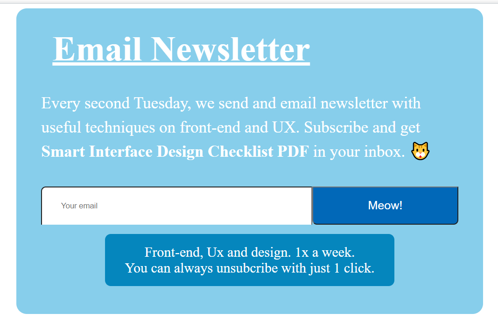

# newsletter-1
this is an assignment to create a newsletter using HTML, CSS and JavaScript

## 
# Image
 "This is the newsletter outlook")

# Built With
* HTML
* CSS
JavaScript

# Author
* 👩Esther Davies
* Github: https://github.com/Esther94
* Twitter: @Esther62849599

# Facilitators
* [Godwin Nwachukwu](https://github.com/Gnwin).

* [Chioma James](https://github.com/Chiomy).

# Acknowledgements
* HomeFrontStartup
* Mentors International
* https://mentorsint.com/
* https://www.facebook.com/mentorshubyola/
* https://twitter.com/hub_mic
* https://www.linkedin.com/company/michub/

# Live Demo (https://raw.githack.com/Esther94/newsletter-1/main/indexx.html)

# 🤝 Contributions
* This project is open to your comments and contributions.
